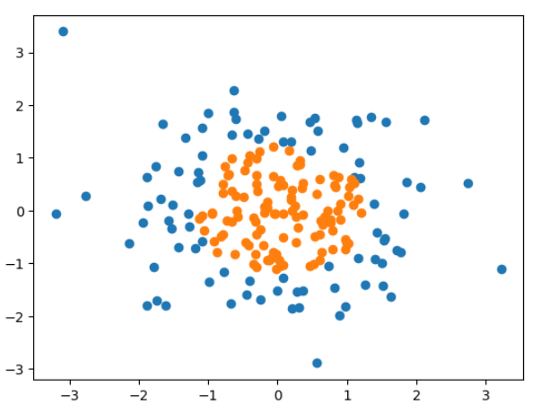
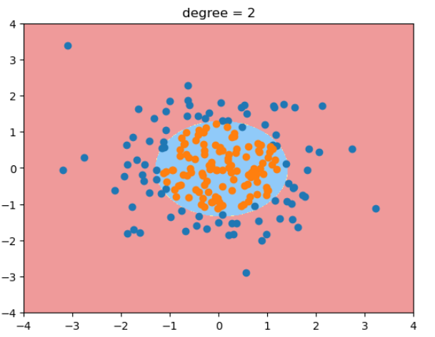
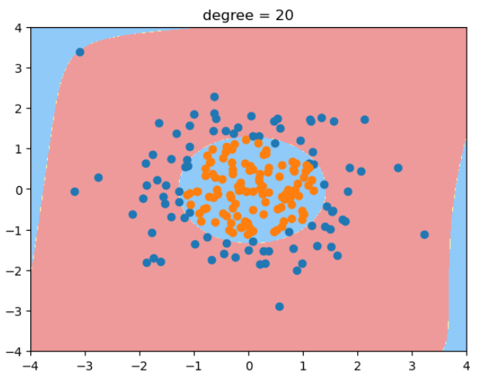

# 逻辑回归中使用多项式特征

引入多项式项从而可以得到曲线边界。

$$ x_1^2 + x_2^2 - r^2 = 0$$

将 $x_1^2$ 视为一个特征，$x_2^2$ 视为一个特征，这样就变成了求解一个线性的决策边界。但对于 $x_1$, $x_2$就变成了一个非线性，圆形的决策边界了。 

用线性回归转到多项式回归的方法，同理可以让线性逻辑回归转化成多项式逻辑回归。这样就可以对非线性的数据做比较好的分类。 决策边界可以是曲线的形状。 

测试数据:
```python
import numpy as np
import matplotlib.pyplot as plt
np.random.seed(666)
X = np.random.normal(0, 1, size = (200, 2))
y = np.array(X[:, 0]**2 + X[:, 1]**2 < 1.5, dtype='int')
plt.scatter(X[y==0, 0], X[y==0, 1])
plt.scatter(X[y==1, 0], X[y==1, 1])
```


```python
import sys
sys.path.append(r'C:\\N-20KEPC0Y7KFA-Data\\junhuawa\\Documents\\00-Play-with-ML-in-Python\\Jupyter')
import playML
from playML.LogisticRegression import LogisticRegression
from sklearn.pipeline import Pipeline
from sklearn.preprocessing import PolynomialFeatures
from sklearn.preprocessing import StandardScaler
def PolynomialLogisticRegression(degree):
    return Pipeline([
        ('poly', PolynomialFeatures(degree = degree)),
        ('std_scaler', StandardScaler()),
        ('log_reg', LogisticRegression())
    ])
poly_log_reg = PolynomialLogisticRegression(degree = 2)
poly_log_reg.fit(X, y)
plot_decision_boundary(poly_log_reg, [-4, 4, -4, 4])
plt.scatter(X[y==0, 0], X[y==0, 1])
plt.scatter(X[y==1, 0], X[y==1, 1])
plt.title("degree = 2")
```





当degree=20时，决策边界变得很奇怪! 过拟合。 - 除了简化模型之外，还可以通过模型正则化来解决过拟合的问题。


