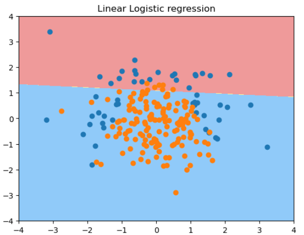
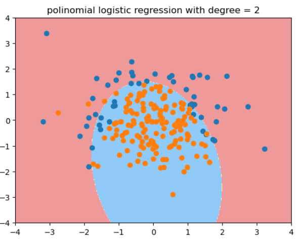
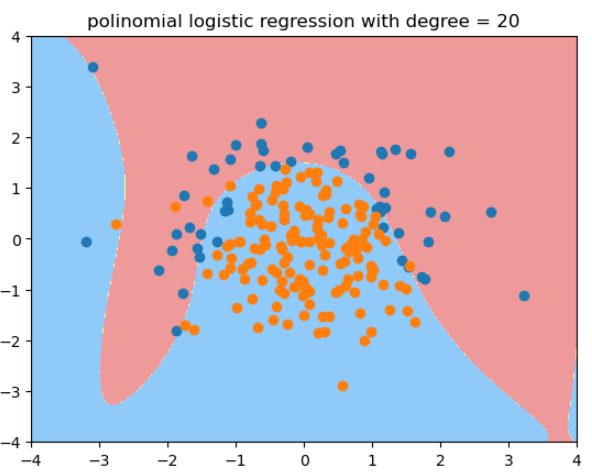
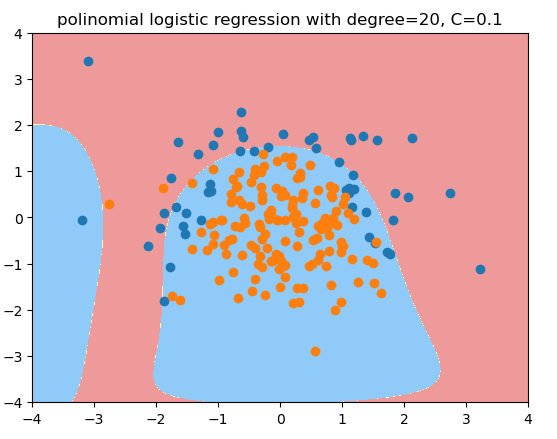
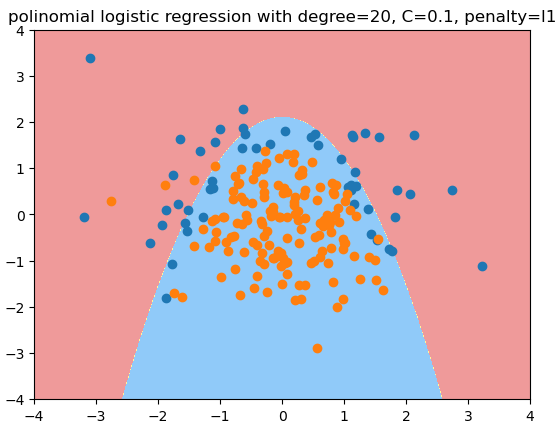

# 逻辑回归中使用正则化

多项式回归中引入正则项：

$$J(\theta) + \alpha L_2 $$

$$J(\theta) + \alpha L_1 $$


引入一个新的正则化超参数: $C$

$$C\cdot J(\theta) + L1$$

$$C\cdot J(\theta) + L2$$


C越大(1000, 10000)，则 $J(\theta)$ 的影响力越小. 
C越小，比如0.1， 0.01， 则正则项更加重要, 也即 $\theta$ 项尽可能小。  

正则项L1, L2， 正则项 $C$ 可以看成是 $L1$, $L2$ 前面的 $\alpha$ 的倒数。
**sklearn中的正则化就是用 $C$ **，  $\alpha$ .这样可以保证必须做正则化. 

sklearn中的LogisticRegression自带了正则化功能，有多个超参数可以配置：
- penalty, 'l2' in default
- C, 1.0 in default
- solver, lbfgs in default
- ......

决策边界为抛物线的测试代码：

```python
import numpy as np
import matplotlib.pyplot as plt
np.random.seed(666)
X = np.random.normal(0, 1, size=(200, 2))# 有200个样本，每个样本2个特征
y = np.array(X[:, 0]**2 + X[:, 1] < 1.5, dtype='int')
for _ in range(20): # 加入20个噪音
    y[np.random.randint(200)] = 1
```

用线性逻辑回归拟合一个决策边界为抛物线的样本的结果：

```python
from sklearn.model_selection import train_test_split
X_train, X_test, y_train, y_test = train_test_split(X, y, random_state=666)
from sklearn.linear_model import LogisticRegression
log_reg = LogisticRegression()
log_reg.fit(X_train, y_train)
plot_decision_boundary(log_reg, axis=[-4, 4, -4, 4])
plt.scatter(X[y==0, 0], X[y==0, 1])
plt.scatter(X[y==1, 0], X[y==1, 1])
```



用度为2的多项式逻辑回归拟合的结果：

```python
from sklearn.pipeline import Pipeline
from sklearn.preprocessing import PolynomialFeatures
from sklearn.preprocessing import StandardScaler
def PolynomialLogisticRegression(degree):
    return Pipeline([
        ('poly', PolynomialFeatures(degree = degree)),
        ('std_scaler', StandardScaler()),
        ('log_reg', LogisticRegression())
    ])
poly_log_reg = PolynomialLogisticRegression(degree=2)
poly_log_reg.fit(X_train, y_train)
plot_decision_boundary(poly_log_reg, axis=[-4, 4, -4, 4])
plt.scatter(X[y==0, 0], X[y==0, 1])
plt.scatter(X[y==1, 0], X[y==1, 1])
```




用度为20的多项式逻辑回归拟合的结果： - 




用度为20, C=0.1的多项式逻辑回归拟合的结果, 更倾向于degree=2的情况:

```python
def PolynomialLogisticRegression(degree, C, penalty = 'l2', solver='liblinear'):
    return Pipeline([
        ('poly', PolynomialFeatures(degree = degree)),
        ('std_scaler', StandardScaler()),
        ('log_reg', LogisticRegression(C = C, penalty = penalty, solver=solver))
    ])
poly_log_regc = PolynomialLogisticRegression(degree=20, C=0.1, solver='liblinear')# 正则化权重大，分类损失函数权重小, 
poly_log_regc.fit(X_train, y_train)
poly_log_regc.score(X_train, y_train)
poly_log_regc.score(X_test, y_test)
plot_decision_boundary(poly_log_regc, axis=[-4, 4, -4, 4])
plt.scatter(X[y==0, 0], X[y==0, 1])
plt.scatter(X[y==1, 0], X[y==1, 1])
plt.title("polinomial logistic regression with degree=20, C=0.1")
```




用度为20, C=0.1, penalty='l1'的多项式逻辑回归拟合的结果 - l1正则项可以减少很多多项式项，使其系数为0，逼近期望的结果 - 原始数据的形状

```python
def PolynomialLogisticRegression(degree, C, penalty = 'l2', solver='liblinear'):
    return Pipeline([
        ('poly', PolynomialFeatures(degree = degree)),
        ('std_scaler', StandardScaler()),
        ('log_reg', LogisticRegression(C = C, penalty = penalty, solver=solver))
    ])
poly_log_regc = PolynomialLogisticRegression(degree=20, C=0.1, penalty = 'l1', solver='liblinear')# 正则化权重大，分类损失函数权重小, 
poly_log_regc.fit(X_train, y_train)
poly_log_regc.score(X_train, y_train)
poly_log_regc.score(X_test, y_test)
plot_decision_boundary(poly_log_regc, axis=[-4, 4, -4, 4])
plt.scatter(X[y==0, 0], X[y==0, 1])
plt.scatter(X[y==1, 0], X[y==1, 1])
plt.title("polinomial logistic regression with degree=20, C=0.1, penalty=l1")
```




真实环境中，我们不知道哪个degree/C/penalty是最佳的超参数，只能通过网格搜索来获得。 
