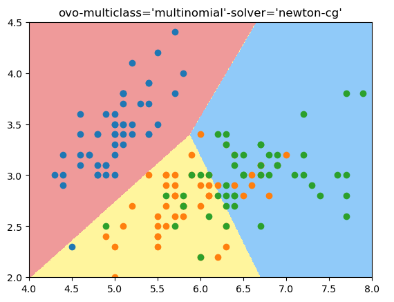
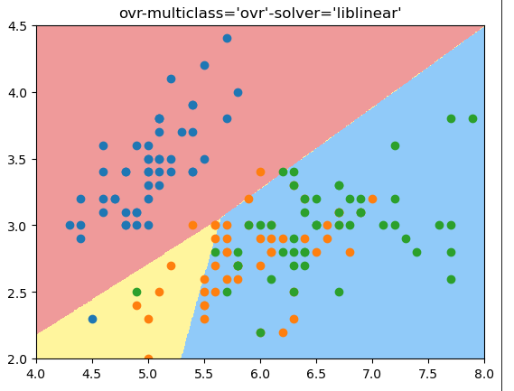

# OvR 与 OvO - 逻辑回归解决多分类问题

所有的二分类算法都可以通过一下的方法改造成多分类算法：
- OvR (One vs Rest) 也叫 (One vs All)
每次只做二分类，区分这个新来的样本点在一个类别和其他的类别中的预测值，然后对其他类别也做这样的分类，得到在每个分类上的预测值，取最大的值对应的类别为这个新来样本点的类别。   
n个类别就要n个分类， 处理一个分类要T， 则要N*T的复杂度

- OvO (One vs One)

每次只挑出2个类别进行二分类， 如果总共有4个类别，则可以形成 $C_4^2 = 6$ 对这样的分类。 复杂度： $C_n^2 * T$. 

因为每次都只用2个类别比较，没有混淆其他类别的信息，所有分类会更加准确。 


sklearn 中的Logistic Regression默认支持多分类，用超参数为 multi_class = 'ovr' or 'ovo'

我这个版本sklearn默认使用 multiclass='ovo', solver='newton-cg' 方式， 既ovo mode.
可以通过使用multiclass='ovr', solver='liblinear'改成ovr mode.

鸢尾花测试数据用2维样本特征做3分类:


```python
import numpy as np
import matplotlib.pyplot as plt
from sklearn.linear_model import LogisticRegression
from sklearn import datasets
iris = datasets.load_iris()
X = iris.data
y = iris.target
X = X[:, :2]#为了可视化，这里只取iris里的前2个维度作为特征进行fit
y = y[:] #分类3中鸢尾花，不再是二分类问题，而是多分类问题了

from sklearn.model_selection import train_test_split
X_train, X_test, y_train, y_test = train_test_split(X, y, random_state=666)

def plot_decision_boundary(model, axis):
    x0, x1 = np.meshgrid(
        np.linspace(axis[0], axis[1], int((axis[1] - axis[0])*100)).reshape(-1, 1), 
        np.linspace(axis[2], axis[3], int((axis[3] - axis[2])*100)).reshape(-1, 1)
    )
    X_new = np.c_[x0.ravel(), x1.ravel()]

    y_predict = model.predict(X_new)
    zz = y_predict.reshape(x0.shape)

    from matplotlib.colors import ListedColormap
    custom_cmap = ListedColormap(['#EF9A9A', '#FFF59D', '#90CAF9'])
    plt.contourf(x0, x1, zz, cmap=custom_cmap)
```

ovo 多分类模式：
```python
log_reg = LogisticRegression()
log_reg.fit(X_train, y_train)
log_reg.score(X_test, y_test)
plot_decision_boundary(log_reg, [4, 8, 2, 4.5])
plt.scatter(X[y==0, 0], X[y==0, 1])
plt.scatter(X[y==1, 0], X[y==1, 1])
plt.scatter(X[y==2, 0], X[y==2, 1])
```

结果： 
score: `0.7894736842105263`



ovr模式：

```python
log_reg1 = LogisticRegression(multi_class='ovr', solver='liblinear') # 这个方式是ovr的方式
log_reg1.fit(X_train, y_train)
log_reg1.score(X_test, y_test)
plot_decision_boundary(log_reg1, [4, 8, 2, 4.5])
plt.scatter(X[y==0, 0], X[y==0, 1])
plt.scatter(X[y==1, 0], X[y==1, 1])
plt.scatter(X[y==2, 0], X[y==2, 1])
plt.title("ovr-multiclass='ovr'-solver='liblinear'")
```
结果： 
score: `0.6578947368421053`



结论：可以看出来，ovr得到的准确度没有ovo好，从决策边界看，ovo的决策边界也更合理


## OvO and OvR 分类器

sklearn提供了OvO and OvR 分类器，任何一个二分类算法都可以用这2个分类器实现多分类功能。 

```python
from sklearn.multiclass import OneVsRestClassifier
X = iris.data
y = iris.target
X_train, X_test, y_train, y_test = train_test_split(X, y, random_state=666)
log_reg1 = LogisticRegression(multi_class='ovr', solver='liblinear')
ovr = OneVsRestClassifier(log_reg1)
ovr.fit(X_train, y_train)
ovr.score(X_test, y_test)

```
score: `0.9473684210526315`

```python
from sklearn.multiclass import OneVsOneClassifier
ovo = OneVsOneClassifier(log_reg)
ovo.fit(X_train, y_train)
ovo.score(X_test, y_test)
```

score: `1.0`